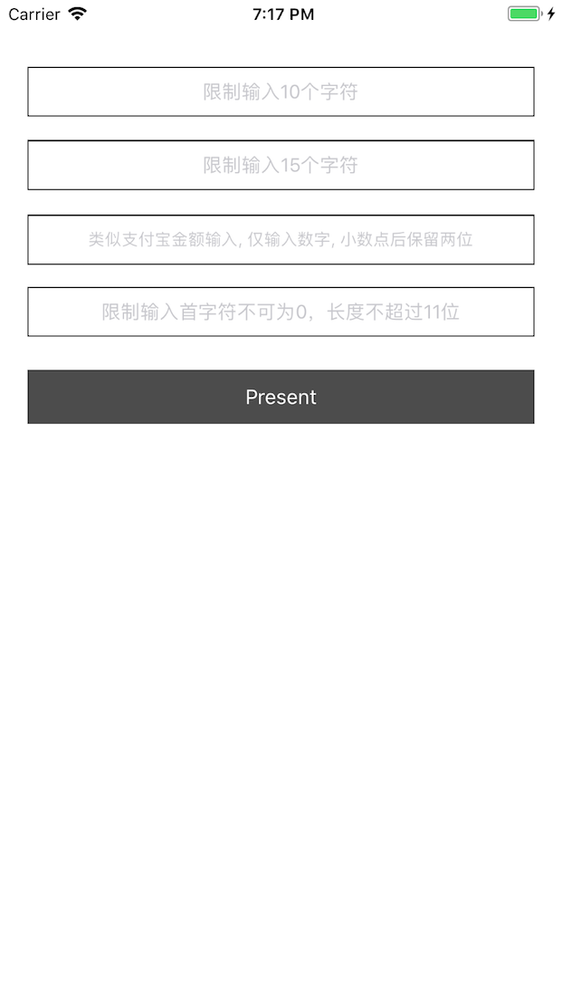

# ZZLimitInputManager
UITextField &amp;&amp; UITextView 长度限制和正则限制

使用方法：把文件夹ZZLimitInputManager托入工程并导入头文件 `#import "ZZLimitInputManager.h"`

####**UITextField**

```objective-c
- (void)viewDidLoad {
    [super viewDidLoad];
    
    // 限制输入10个字符长度
    [ZZLimitInputManager limitInputView:self.textField_1 maxLength:10];

    // 限制输入15个字符长度
    [ZZLimitInputManager limitInputView:self.textField_2 maxLength:15];

    // 类似支付宝金额输入, 仅输入数字, 小数点后保留两位(最多到分), 在xib中设置键盘类型
    [ZZLimitInputManager limitInputView:self.textField_3 regX:@"^\\-?([0-9]\\d{0,5})(\\.\\d{0,2})?$"];
    
    // 限制不可输入首字符为0, 手机号码至多11位(xib中设置数字键盘)
    [ZZLimitInputManager limitInputView:self.textField_4 maxLength:11];
    [ZZLimitInputManager limitInputView:self.textField_4 regX:@"[^0].*"];
}
```

#####**UITextView**

```objective-c
- (void)viewDidLoad {
    [super viewDidLoad];
    
    // 限制输入10个字符长度
    [ZZLimitInputManager limitInputView:self.textView_1 maxLength:10];
    
    // 限制输入15个字符长度
    [ZZLimitInputManager limitInputView:self.textView_2 maxLength:15];
    
    // 限制不可输入首字符为0
    [ZZLimitInputManager limitInputView:self.textView_3 regX:@"[^0].*"];
    
    // 限制不可输入首字符为0, 手机号码至多11位(xib中设置数字键盘)
    [ZZLimitInputManager limitPhoneInputView:self.textView_4];
}
```


